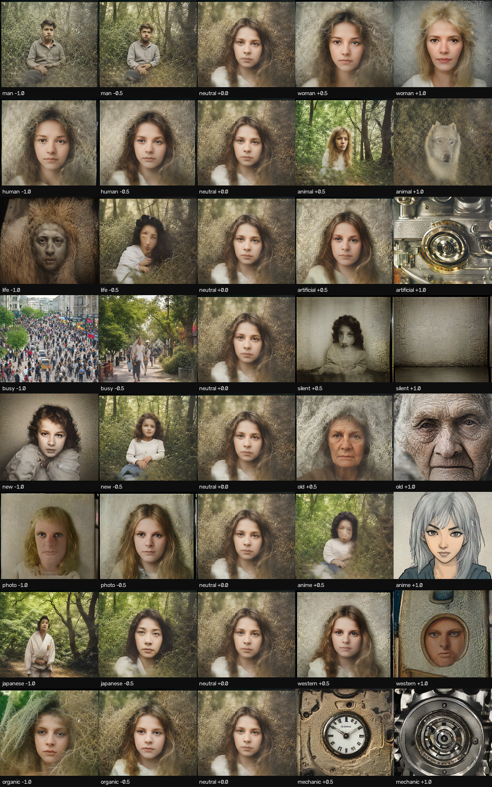

# Semantic Explorer

Play the semantic space of a diffusion model with a MIDI controller, in real time.

Eight knobs are **concept axes** — man↔woman, human↔animal, organic↔mechanic — and
turning one slides the image along that concept while it regenerates continuously.
Built on [StreamDiffusion](https://github.com/cumulo-autumn/StreamDiffusion) and
SD-Turbo, running at **~12 fps at 512×512 on an RTX 3060**.



*Every axis swept from −1 to +1 with the noise latent held fixed, so only the concept
moves.*

## The instrument

```
python midi_latent.py
python midi_latent.py --width 384 --height 384   # ~26 fps, more playable
python midimon.py                                # see what your controller sends
```

Tested with an Akai LPD8 mk2 (8 knobs, 8 pads). The mapping is learned at runtime, so
any controller works.

| knob | axis | knob | axis |
|---|---|---|---|
| 1 | man ↔ woman | 5 | new ↔ old |
| 2 | human ↔ animal | 6 | photorealistic ↔ anime |
| 3 | life ↔ artificial | 7 | japanese ↔ western |
| 4 | busy ↔ silent | 8 | organic ↔ mechanic |

Knobs read as neutral until you first move them, so the image never depends on where
the physical knobs happen to be sitting. Slots are assigned by sorting the CC numbers
seen so far — move each knob once and the mapping settles into physical order.

**Pads** fire velocity-scaled impulses into the noise latent. `note_off` is ignored, so
a pad is a strike, not a gate — only how hard you hit matters. Each impulse decays as
`exp(−age / 0.55s)`, and hits accumulate, so repeated taps drive the latent further.
The eight pad directions are mutually orthogonal, so combinations stay distinct.

Keys in the window: `r` new latent · `n` new pad directions · `c` recentre knobs ·
`d` drift · `h` HUD · `[` `]` scene · `-` `=` pad depth · `s` save · `q` quit.

## How the semantic knobs work

The knobs are **not** latent directions — semantics do not live in the noise. A random
direction in latent space changes pose and framing, not gender or age.

Each knob is a direction in **CLIP text-embedding space**, built as
`E(right prompt) − E(left prompt)` from a pair that shares a template and differs only
in the concept. Turning a knob adds a multiple of that vector to the scene embedding
before the UNet sees it:

```python
emb = scene_embedding
for knob, axis in zip(knobs, axes):
    emb = emb + knob * SEM_DEPTH * axis
```

Three things had to be right for this to work:

- **Minimal pairs.** Verbose prompts spread the difference across filler tokens and
  dilute it. `"a portrait photograph of a person"` vs `"…of a wolf"` beats a sentence
  full of adjectives. An early verbose `human/animal` pair did almost nothing.
- **Per-axis calibration.** Raw difference vectors range from 76 (human/animal) to 200
  (life/artificial) in length, and concepts need different pushes to land against a
  portrait base — a robot has to overcome a very confident human face, a wolf does not.
  Each axis is rescaled to its own tuned `strength`. Without this, some knobs did
  nothing while others blew the image out.
- **Strength and depth multiply.** `SEM_DEPTH` is fixed at 1.5 so all eight knobs can be
  axes; the per-axis strengths are calibrated *at that depth*. Changing `SEM_DEPTH`
  without rescaling them pushes several axes past their concept into abstraction.

The noise latent is re-projected onto its original hypersphere after modulation. A
full-velocity pad hit adds 2.2× the latent's own magnitude, but because the sum is
renormalised it **rotates** the latent (~65°) rather than inflating it — which is what
keeps the UNet seeing a vector the right length for noise it was trained on, instead of
washing the image out.

Regenerate the calibration sheet after changing any axis:

```python
# sweeps every axis with the latent fixed -> outputs/semantic_axes.png
python axes_sheet.py
```

## Setup

Needs an NVIDIA GPU. Built with `uv`:

```
git clone https://github.com/cumulo-autumn/StreamDiffusion.git upstream
uv venv --python 3.11 .venv
uv pip install --index-url https://download.pytorch.org/whl/cu128 torch torchvision
uv pip install diffusers transformers accelerate safetensors peft fire omegaconf pillow
uv pip install mido python-rtmidi opencv-python
uv pip install --no-deps -e ./upstream
```

Resulting stack: torch 2.11.0+cu128, diffusers 0.40.0, transformers 5.15.1, Python 3.11.
Models download from HuggingFace on first run (~4 GB).

### Why `--no-deps`

Upstream pins `diffusers==0.24.0` (Nov 2023), which no longer imports against a current
`huggingface_hub`. Installing without its dependency pins and patching the API drift at
import time is far less work than pinning the whole stack backwards. `compat.py`
handles three changes:

1. **`fuse_lora()`** — diffusers replaced `fuse_unet=`/`fuse_text_encoder=` with
   `components=[...]`. Needed for the LCM-LoRA path.
2. **`from_pretrained()`** — upstream calls it with no kwargs, which drags in the
   1.2 GB safety checker and fp32 weights. The shim forces `safety_checker=None`,
   `torch_dtype=float16`, and prefers the `fp16` weight variant.
3. **`retrieve_latents`** — restored if absent from the img2img pipeline module.

No `xformers`, no TensorRT: torch's SDPA attention is the default in current diffusers
and is competitive with xformers on Ampere.

## Benchmarks

```
python bench.py --model stabilityai/sd-turbo --t-index 0 --iters 50
python demo.py --count 12 --cols 4
python sweep.py
```

Headline on an RTX 3060: **26 img/s at 384×384**, **15.4 img/s at 512×512**, under
4.4 GiB VRAM. Stream batch is worth **1.33×** over sequential denoising on a
multi-step model. Full numbers and analysis in [RESULTS.md](RESULTS.md).

`--t-index` is StreamDiffusion's `t_index_list`: which timesteps out of a nominal
50-step schedule actually get denoised. `0` is a single step; `0,16,32,45` is the
canonical 4-step LCM setup. `--fbs` (frame buffer size) batches independent frames
through the UNet together.

## Files

| path | what it is |
|---|---|
| `midi_latent.py` | the instrument |
| `midimon.py` | prints raw MIDI, for checking what your controller sends |
| `axes_sheet.py` | regenerates the calibration sheet |
| `compat.py` | shims that let 2023-era upstream code run on current diffusers |
| `bench.py` / `sweep.py` | throughput benchmarks |
| `demo.py` | batch generation into a contact sheet |
| `report.html` / `build_report.py` | benchmark report template and generator |
| `upstream/` | clone of `cumulo-autumn/StreamDiffusion` (not vendored — clone it) |

## Licence

The code here is MIT. StreamDiffusion is Apache-2.0; SD-Turbo has its own
[licence](https://huggingface.co/stabilityai/sd-turbo).
